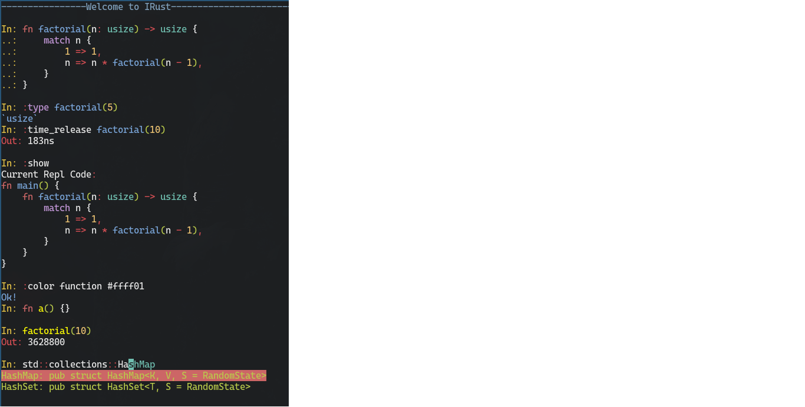

# IRust
Cross Platform Rust Repl

## Keywords / Tips & Tricks

**:help** => print help

**:reset** => reset repl

**:show** => show repl current code (optionally depends on [rustfmt](https://github.com/rust-lang/rustfmt) to format output)

**:add** *<dep_list>* => add dependencies (requires [cargo-edit](https://github.com/killercup/cargo-edit)) also it accepts most `cargo-edit` arguments

**:type** *<expression>* => shows the expression type, example `:type vec!(5)`

**:load** => load a rust file into the repl

**:reload** => reload the last specified file

**:pop** => remove last repl code line

**:del** *<line_num>* => remove a specific line from repl code (line count starts at 1 from the first expression statement)

**:edit** *\<editor\>* => edit internal buffer using an external editor, example: `:edit micro`, Note that any edit made to `$TEMP/irust/src/main_extern.rs` file will be immediatly reflected on the repl (after saving)

**:cd** => change current working directory

**:color** *<key>* *<value>* => change token highlight color at runtime, for the token list and value representation check the Theme section, exp: `:color function red` `:color macro #ff12ab` `:color reset`

**:toolchain** *<value>* => switch between toolchains, supported value are: `stable`, `beta`, `nighty`

**::** => run a shell command, example `::ls`

You can use arrow keys to cycle through commands history

## Keybindings

**ctrl-l** clear screen

**ctrl-c** clear line

**ctrl-d** exit if buffer is empty

**ctrl-z** [unix only]  send IRust to the background

**ctrl-r** search history

**ctrl-left/right** jump through words

**HOME/END** go to line start / line end

**Tab/ShiftTab** cycle through auto-completion suggestions (requires [racer](https://github.com/racer-rust/racer))

**Alt-Enter** add line break

**ctrl-e** force evaluation



## Cli commands

**irust** *<path_to_file>* starts irust with the specified file loaded into the repl

**--help** prints help message

**--reset-config** reset IRust configuration to default

## Configuration

IRust config file is located in:

**Linux**: */home/$USER/.config/irust/config*

**Win**: *C:\Users\\$USER\AppData\Roaming/irust/config*

**Mac**: */Users/$USER/Library/Preferences/irust/config*

*default config:*
```
  // history
  add_irust_cmd_to_history = true
  add_shell_cmd_to_history = false

  // colors
  ok_color = "Blue"
  eval_color = "White"
  irust_color = "DarkBlue"
  irust_warn_color = "Cyan"
  out_color = "Red"
  shell_color = "DarkYellow"
  err_color = "DarkRed"
  input_color = "Green"
  insert_color = "White"
  welcome_msg = ""
  welcome_color = "DarkBlue"

  // racer
  racer_inline_suggestion_color = "Cyan"
  racer_suggestions_table_color = "Green"
  racer_selected_suggestion_color = "DarkRed"
  racer_max_suggestions = 5
  enable_racer = true

  // other
  first_irust_run = false
  toolchain = "stable"
```

## Theme
Since release `0.8.9` `IRust` can now parse a theme file located on `$config_dir/irust/theme` and use it for the highlighting colors.

Colors can be specified as names ("red") or as hex representation ("#ff12ab").

Default theme file:

```
  keyword = "magenta"
  keyword2 = "dark_red"
  function = "blue"
  type = "cyan"
  number = "dark_yellow"
  symbol = "red"
  macro = "dark_yellow"
  string_literal = "yellow"
  character = "green"
  lifetime = "dark_magenta"
  comment = "dark_grey"
  const = "dark_green"
  x = "white"

```

## Releases
   Automatic releases by github actions are uploaded here https://github.com/sigmaSd/irust/releases

## Building
    cargo b --release

## FAQ

**1- Why is autocompletion not working**

    -> you need racer installed and configured correctly
        cargo +nightly install racer
        rustup component add rust-src

## [Changelog](./CHANGELOG.md)
